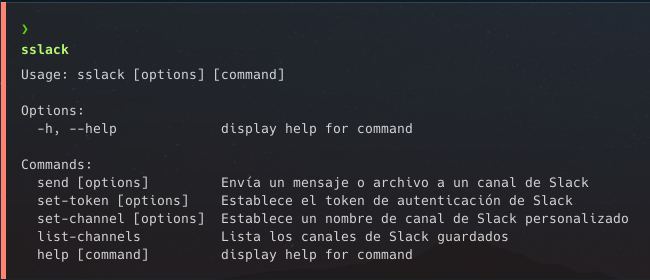

# sslack


sslack es una herramienta de línea de comandos (CLI) que permite interactuar con Slack enviando mensajes y archivos a canales de tu workspace. Solo necesitas el OAuth Token que te provee Slack para un workspace con los permisos necesarios.

## Ejemplo de uso

```bash
sslack send --channel XXXXXX --message "Hello, world!" --token XXXXXX
```

```bash
sslack send -c XXXXXX --file /path/to/file --t XXXXXX
```

Puedes almacenar localmente el token y los nombres de canales (`HOME_DIR/.sslackConfig`) para no tener que especificarlos en cada comando:

```bash
slack set-channel -c XXXXXX -n test_channel
slack set-token -t XXXXXX
```

```bash
sslack send -n test_channel -m "Hello, world!"
```

## Instalación del repositorio

Para crearte el ejecutable `sslack`, necesitas tener **Node.js** y **Bun** instalados en tu máquina. Luego, puedes clonar este repositorio y ejecutar `bun install` para instalar las dependencias.

```bash
git clone <url del repositorio>
cd sslack
bun install
```

## Crear un ejecutable (Linux)

Para crear un ejecutable de sslack, puedes ejecutar el script build definido en el archivo package.json:

```bash
bun run build
```

Esto te creara un ejecutable en el siguiente directorio: `./dist/sslack	`

## Instalarlo globalmente

Si tras exportar el ejecutable deseas instalarlo globalmente en tu sistema, puedes ejecutar el siguiente comando para copiar tu ejecutable a la carpeta `/usr/local/bin`:

```bash
sudo cp ./dist/sslack /usr/local/bin
```

## Contribuir

Si deseas contribuir a sslack, puedes hacer un fork del repositorio, crear una nueva rama para tus cambios, y luego hacer un pull request. Asegúrate de que tus cambios pasen todos los tests antes de hacer el pull request.

## Licencia

sslack está licenciado bajo la licencia MIT, que puedes leer en el archivo [LICENSE.md](LICENSE.md).
